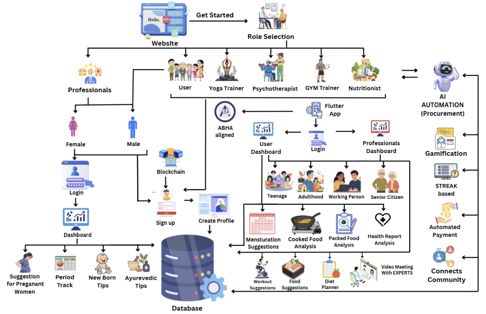
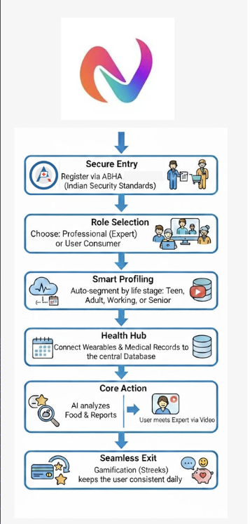
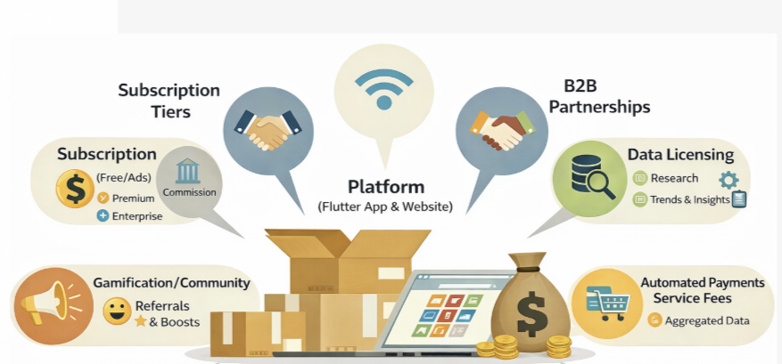

# ChidiyaGHAR-AgentX-AI-Automation-Hackathon

## 📊 Project Strategy & Workflows

| Workflow Phase 1 | Workflow Phase 2 | Revenue Generation Model |
| :---: | :---: | :---: |
|  |  |  |

---

Vita AI is an advanced AI-powered health and wellness automation platform designed for the AgentX-AI-Automation-Hackathon. It integrates cutting-edge AI technologies, Web3 decentralized identity, and real-time consultation features to provide a comprehensive healthcare experience.

---

## 🚀 Project Workflow

Our platform follows a sophisticated multi-stage workflow to ensure data privacy, accurate AI analysis, and seamless user interaction.

### Workflow Phase 1: Authentication & Data Collection
Securely board users and collect initial health metrics.

### Workflow Phase 2: AI Analysis & Consultation
Utilize Gemini AI for diagnostics and facilitate expert consultations.

---

## 💰 Revenue Generation Model

Vita AI is designed with a sustainable business model that balances accessibility for users with profitability for service providers.

### Key Monetization Strategies:
1. **Tiered Subscription Plans**: Personal, Family, and Enterprise levels for AI-driven health monitoring.
2. **Consultation Marketplace**: Small transaction fee on every successful video consultation with verified professionals.
3. **Enterprise API Access**: Licensing our health-AI analysis engine to insurance providers and hospitals.
4. **Web3 Data Rewards**: Users can opt-in to share anonymized health data for research in exchange for utility tokens.

---

## ✨ Core Features

- **AI-Powered Diagnostics**: Leveraging Google Gemini for intelligent symptom analysis and health recommendations.
- **Real-time Consultations**: Integrated video calls using Stream.io and Agora RTC for expert advice.
- **Web3 Integration**: Secure, decentralized data management using `web3dart`.
- **Comprehensive Dashboard**: Real-time health tracking with dynamic charts and analytics.
- **PDF Reports**: Automated generation of health summaries and consultation records.

---

## 🛠 Tech Stack

- **Framework**: Flutter (Dart)
- **Backend / DB**: Supabase
- **AI Engine**: Google Generative AI (Gemini)
- **Communication**: Stream Video SDK & Agora RTC
- **Web3**: Ethereum / Web3dart integration
- **State Management**: Flutter Riverpod

---

**Built with ❤️ for the CODE AUTOMATA HACKATHON**
#